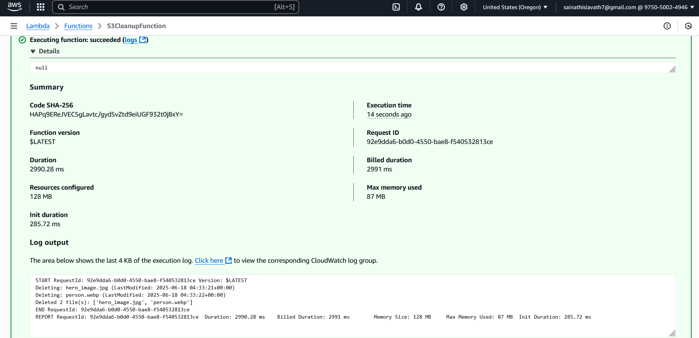

# Assignment 2: Automated S3 Bucket Cleanup Using AWS Lambda & Boto3

## Objective
Automatically delete files older than 30 days in an AWS S3 bucket using an AWS Lambda function written in Python (Boto3).  
For testing purposes, the retention period was temporarily set to **5 minutes** so that deletion could be verified quickly.

---

## Setup & Implementation

### Step 1: Create and Configure S3 Bucket
- Created a new S3 bucket: `s3-cleanup-assignment-sainath`
- Uploaded 6 test files to the bucket
- Some files were made older than 5 minutes to simulate "old files"

### Step 2: IAM Role for Lambda
- Created IAM Role: `lambda-s3-cleanup-role`
- Attached Policy: `AmazonS3FullAccess`
  > 🔐 **Note**: In real-world usage, use scoped-down permissions for security best practices.

### Step 3: Create Lambda Function
- Function Name: `S3CleanupFunction`
- Runtime: Python 3.12
- Assigned IAM role created above
- Increased default timeout to **30 seconds**
- Manually invoked for testing purposes

## Results & Testing
- Lambda was executed manually using the test console (`{}` event).
- Files older than 5 minutes were correctly identified and deleted.
- Verified through:
    - S3 object list before/after
    - CloudWatch logs

## Screenshots

- Create S3 Bucket

- Upload 5-6 files

- Create IAM Role

- Add permission (AmazonS3FullAccess)

- Review:

- Create Lambda Function

- Test the event

- Got error as time is only 3 seconds

- Succeeded after editing time to 30 seconds

- Results
